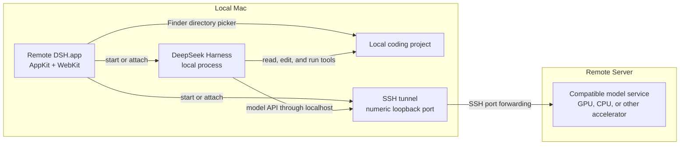

# Remote DSH for macOS

English | [简体中文](README.zh-CN.md)

### Use DeepSeek Harness with models running on a remote GPU server — from a native Mac app.

**Your remote server runs the model. Your Mac gets the native workflow.**

Remote DSH turns an existing DeepSeek Harness and remote model setup into a
native macOS workflow. Open one app to start or attach to the SSH tunnel, launch
or connect to Harness, choose a local coding project, and keep the processes it
owns under control.

The common setup uses a remote GPU server, but the wrapper only requires a
compatible remote model service reachable through your SSH configuration. It
does not require or inspect a particular accelerator.

## Features

| | Capability |
| --- | --- |
| Native macOS shell | Presents Harness in an AppKit window with an embedded WebKit workspace. |
| Automatic SSH lifecycle | Detects the configured loopback tunnel and starts it only when needed. |
| Automatic Harness lifecycle | Attaches to a healthy local Harness instance or launches your configured profile. |
| Finder project picker | Opens a native directory picker and registers the selected local project with Harness. |
| Safe process ownership | Stops only the exact SSH and Harness children started by this app. |
| Local-first wrapper | Adds no telemetry, credential storage, or separate project upload. |

## Why Remote DSH?

Using a remote model from a Mac normally means keeping several pieces in sync:

```text
Terminal  → SSH tunnel
Terminal  → Harness launcher
Browser   → Harness UI
Finder    → Project paths
Terminal  → Process cleanup
```

Remote DSH turns that into:

```text
Remote DSH.app → Open Project → Start coding
```

The app coordinates the local workflow while leaving the model computation on
your remote server. If the tunnel or Harness is already healthy, it attaches
without taking ownership.

## How it works



DeepSeek Harness and the selected project stay on the Mac. The remote server
runs the model service; the existing SSH alias defines how the local port is
forwarded to it.

## Quick Start

1. Prepare an SSH alias that creates the required local forward to your remote
   model service.
2. Prepare an executable launcher for your local DeepSeek Harness profile.
3. Clone this repository, enter its directory, and install the neutral
   configuration example:

   ```bash
   cd remote-dsh-macos
   mkdir -p "$HOME/Library/Application Support/RemoteDSH"
   cp Resources/config.example.plist \
     "$HOME/Library/Application Support/RemoteDSH/config.plist"
   ```

4. Edit the configuration for your own SSH alias, ports, and Harness launcher:

   ```bash
   ${EDITOR:-vi} "$HOME/Library/Application Support/RemoteDSH/config.plist"
   ```

5. Run the app from source:

   ```bash
   swift run RemoteDSHApp
   ```

## Requirements

- macOS 14 or later on Apple Silicon
- Swift 6 toolchain
- An existing SSH alias that creates the local tunnel to the remote model
- A user-managed executable that starts the configured local Harness profile
- A compatible model service reachable through that tunnel

Remote DSH does not generate SSH configuration, install DeepSeek Harness, or
manage model-provider credentials.

## Configuration

The runtime configuration is stored at:

```text
$HOME/Library/Application Support/RemoteDSH/config.plist
```

| Key | Required | Purpose |
| --- | --- | --- |
| `sshAlias` | Yes | Existing SSH alias used to establish the model tunnel. |
| `sshLocalPort` | Yes | Numeric loopback port created by the SSH alias. |
| `harnessPort` | Yes | Local port used by the Harness Web Host. |
| `harnessLauncherPath` | Yes | Absolute executable path, or a path beginning with `~/`, that starts the configured Harness profile. |
| `displayModelName` | No | Non-sensitive label shown in the app UI. |

The example file uses only neutral values and contains no credential fields.
Both ports must be between `1` and `65535` and must differ.

## Build and test from source

Run the behavioral, packaging, and privacy checks:

```bash
swift run RemoteDSHTestRunner
/bin/bash Scripts/test-public-tree.sh
/bin/bash Scripts/test-public-history.sh
/bin/bash Scripts/test-atomic-install.sh
/bin/bash Scripts/test-build-app.sh
/bin/bash Scripts/verify-public-tree.sh .
/bin/bash Scripts/verify-public-history.sh .
```

Build an ad-hoc-signed local app only at an explicit absolute destination, then
verify and open that copy:

```bash
temporary_root="$(mktemp -d)"
/bin/bash Scripts/build-app.sh \
  "$temporary_root/Remote DSH for macOS.app"
/bin/bash Scripts/verify-bundle.sh \
  "$temporary_root/Remote DSH for macOS.app"
open "$temporary_root/Remote DSH for macOS.app"
```

`build-app.sh` never chooses an Applications directory for you. When replacing
an existing explicit destination, it retains the previous bundle under the
destination parent's `.remote-dsh-backups` directory.

## Built to stay out of your way

Remote DSH does not kill processes by name. It retains exact handles only for
the SSH and Harness child processes it launches, then stops those children in
Harness-then-SSH order when the app exits.

If a healthy tunnel or Harness instance was already running, Remote DSH simply
attaches to it and leaves it running on quit.

## Safety and privacy

- The configuration file remains local. Wrapper RPC and embedded Harness
  traffic stay on configured numeric loopback origins.
- Embedded navigation is limited to the configured Harness origin; genuine
  external HTTP and HTTPS links open in the default browser.
- The wrapper contains no provider credentials, collects no analytics, and
  sends no telemetry.
- Project content handled by Harness follows your separately managed Harness
  and model configuration. Remote DSH adds no separate project upload.
- Diagnostics are bounded and sanitized before they are shown.

For security reports, see [SECURITY.md](SECURITY.md).

## Limitations

- The current public version is source-only and Apple Silicon/macOS 14+ only.
- It does not include a notarized download, DMG, updater, or Homebrew cask.
- SSH configuration, the remote model service, Harness installation, and
  provider credentials remain user-managed.
- The Finder picker selects local Mac project directories; it is not a remote
  filesystem browser.
- Search is not supplied or promised by this wrapper. Any search tool belongs
  to your separately managed Harness profile.
- GPU acceleration is a common deployment choice, not a wrapper requirement.

## Roadmap

- [x] Native AppKit/WebKit shell
- [x] Automatic SSH and Harness start-or-attach lifecycle
- [x] Native local-project picker
- [x] Exact child-process ownership and safe shutdown
- [ ] Privacy-safe demo assets recorded in a neutral environment
- [ ] First source-only GitHub release

Future distribution work will be evaluated only after the signing, notarization,
and release pipeline can be verified. These items are directions, not delivery
commitments.

## Contributing

Issues and focused pull requests are welcome. Before submitting a change, run:

```bash
swift run RemoteDSHTestRunner
/bin/bash Scripts/verify-public-tree.sh .
/bin/bash Scripts/verify-public-history.sh .
```

Please keep examples neutral and do not commit credentials, real hostnames, SSH
aliases, private project paths, session data, or generated app bundles.

## Disclaimer and upstream

Remote DSH for macOS is an unofficial community project. It is not affiliated
with, endorsed by, or an official product of DeepSeek.

The upstream runtime is
[DeepSeek Harness](https://github.com/deepseek-ai/deepseek-harness), distributed
separately under its
[MIT license](https://github.com/deepseek-ai/deepseek-harness/blob/master/LICENSE).
This wrapper does not embed that runtime.

## License

Remote DSH for macOS is released under the [MIT License](LICENSE). See
[THIRD_PARTY_NOTICES.md](THIRD_PARTY_NOTICES.md) for upstream attribution.
