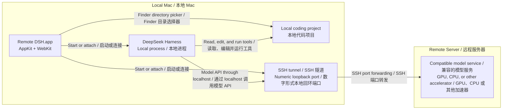

# Remote DSH for macOS

<p align="center">
  <a href="#features">Features</a> ·
  <a href="#architecture">Architecture</a> ·
  <a href="#quick-start">Quick Start</a> ·
  <a href="#limitations">Limitations</a> ·
  <a href="#中文">中文</a>
</p>

[](https://github.com/%54amarisk-%44u/remote-dsh-macos/releases/latest)


### Use DeepSeek Harness with models running on a remote GPU server — from a native Mac app.

<a id="中文"></a>

### 在原生 Mac App 中，让 DeepSeek Harness 使用运行于远程 GPU 服务器的模型。

**Your remote server runs the model. Your Mac gets the native workflow.**

**远程服务器负责运行模型，Mac 获得原生工作流。**

Remote DSH turns an existing DeepSeek Harness and remote model setup into a
native macOS workflow. Open one app to start or attach to the SSH tunnel, launch
or connect to Harness, choose a local coding project, and keep the processes it
owns under control.

Remote DSH 将现有的 DeepSeek Harness 与远程模型配置整合成原生 macOS
工作流。只需打开一个 App，即可启动或连接 SSH 隧道、启动或连接 Harness、选择
本地代码项目，并安全管理由 App 自己启动的进程。

The common setup uses a remote GPU server, but the wrapper only requires a
compatible remote model service reachable through your SSH configuration. It
does not require or inspect a particular accelerator.

常见部署会使用远程 GPU 服务器，但本封装只要求远程模型服务能够通过用户的 SSH
配置访问，不要求也不会检测某一种特定加速器。

<a id="features"></a>

## Features / 功能

| Capability / 能力 | What it does / 作用 |
| --- | --- |
| Native macOS shell<br>原生 macOS 外壳 | Presents Harness in an AppKit window with an embedded WebKit workspace.<br>使用 AppKit 窗口和内嵌 WebKit 工作区呈现 Harness。 |
| Automatic SSH lifecycle<br>自动管理 SSH 生命周期 | Detects the configured loopback tunnel and starts it only when needed.<br>检测配置的本地回环隧道，仅在需要时启动。 |
| Automatic Harness lifecycle<br>自动管理 Harness 生命周期 | Attaches to a healthy local Harness instance or launches your configured profile.<br>连接健康的本地 Harness，或启动用户配置的 Harness profile。 |
| Finder project picker<br>Finder 项目选择器 | Opens a native directory picker and registers the selected local project with Harness.<br>打开原生目录选择器，并将选中的本地项目注册到 Harness。 |
| Safe process ownership<br>安全的进程所有权 | Stops only the exact SSH and Harness children started by this app.<br>只停止本 App 亲自启动的 SSH 和 Harness 子进程。 |
| Local-first wrapper<br>本地优先的封装 | Adds no telemetry, credential storage, or separate project upload.<br>不增加遥测、凭据存储或额外的项目上传。 |

## Why Remote DSH? / 为什么使用 Remote DSH？

Using a remote model from a Mac normally means keeping several pieces in sync.

在 Mac 上使用远程模型，通常需要同时维护多个环节。

```text
Terminal / 终端  → SSH tunnel / SSH 隧道
Terminal / 终端  → Harness launcher / Harness 启动器
Browser / 浏览器 → Harness UI
Finder           → Project paths / 项目路径
Terminal / 终端  → Process cleanup / 进程清理
```

Remote DSH turns that into one short workflow.

Remote DSH 将这套流程缩短为一个简单工作流。

```text
Remote DSH.app → Open Project / 打开项目 → Start coding / 开始写代码
```

The app coordinates the local workflow while leaving the model computation on
your remote server. If the tunnel or Harness is already healthy, it attaches
without taking ownership.

App 负责协调 Mac 上的本地工作流，模型计算仍然留在远程服务器。如果 SSH 隧道或
Harness 已经健康运行，它会直接连接，不会接管所有权。

<a id="architecture"></a>

## How it works / 工作原理



DeepSeek Harness and the selected project stay on the Mac. The remote server
runs the model service; the existing SSH alias defines how the local port is
forwarded to it.

DeepSeek Harness 和选中的项目都留在 Mac 本地。远程服务器运行模型服务；已有的
SSH alias 决定如何把本地端口转发到该服务。

<a id="quick-start"></a>

## Quick Start / 快速开始

1. Prepare an SSH alias that creates the required local forward to your remote
   model service.

   准备一个 SSH alias，用于建立到远程模型服务所需的本地端口转发。

2. Prepare an executable launcher for your local DeepSeek Harness profile.

   准备一个可执行启动器，用于启动本地 DeepSeek Harness profile。

3. Clone this repository, enter its directory, and install the neutral
   configuration example.

   克隆本仓库、进入仓库目录，然后安装中性的配置示例。

   ```bash
   cd remote-dsh-macos
   mkdir -p "$HOME/Library/Application Support/RemoteDSH"
   cp Resources/config.example.plist \
     "$HOME/Library/Application Support/RemoteDSH/config.plist"
   ```

4. Edit the configuration for your own SSH alias, ports, and Harness launcher.

   根据自己的 SSH alias、端口和 Harness 启动器修改配置。

   ```bash
   ${EDITOR:-vi} "$HOME/Library/Application Support/RemoteDSH/config.plist"
   ```

5. Run the app from source.

   从源码运行 App。

   ```bash
   swift run RemoteDSHApp
   ```

## Requirements / 系统要求

- macOS 14 or later on Apple Silicon<br>
  搭载 Apple Silicon 的 macOS 14 或更高版本
- Swift 6 toolchain<br>
  Swift 6 工具链
- An existing SSH alias that creates the local tunnel to the remote model<br>
  一个能够为远程模型建立本地隧道的现有 SSH alias
- A user-managed executable that starts the configured local Harness profile<br>
  一个由用户管理、用于启动本地 Harness profile 的可执行文件
- A compatible model service reachable through that tunnel<br>
  一个能够通过该隧道访问的兼容模型服务

Remote DSH does not generate SSH configuration, install DeepSeek Harness, or
manage model-provider credentials.

Remote DSH 不会生成 SSH 配置、安装 DeepSeek Harness 或管理模型服务商凭据。

## Configuration / 配置

The runtime configuration is stored at the following path.

实际运行时配置保存在以下路径。

```text
$HOME/Library/Application Support/RemoteDSH/config.plist
```

| Key / 键 | Required / 必需 | Purpose / 用途 |
| --- | --- | --- |
| `sshAlias` | Yes / 是 | Existing SSH alias used to establish the model tunnel.<br>用于建立模型隧道的现有 SSH alias。 |
| `sshLocalPort` | Yes / 是 | Numeric loopback port created by the SSH alias.<br>由 SSH alias 建立的数字形式本地回环端口。 |
| `harnessPort` | Yes / 是 | Local port used by the Harness Web Host.<br>Harness Web Host 使用的本地端口。 |
| `harnessLauncherPath` | Yes / 是 | Absolute executable path, or a path beginning with `~/`, that starts the configured Harness profile.<br>用于启动指定 Harness profile 的绝对可执行路径，或以 `~/` 开头的路径。 |
| `displayModelName` | No / 否 | Non-sensitive label shown in the app UI.<br>仅在 App 界面中显示的非敏感标签。 |

The example file uses only neutral values and contains no credential fields.
Both ports must be between `1` and `65535` and must differ.

示例文件只使用中性值，不包含凭据字段。两个端口必须都在 `1` 到 `65535` 之间，
并且不能相同。

## Build and test from source / 从源码构建和测试

Run the behavioral, packaging, and privacy checks.

运行行为、打包和隐私检查。

```bash
swift run RemoteDSHTestRunner
/bin/bash Scripts/test-public-tree.sh
/bin/bash Scripts/test-public-history.sh
/bin/bash Scripts/test-atomic-install.sh
/bin/bash Scripts/test-build-app.sh
/bin/bash Scripts/verify-public-tree.sh .
/bin/bash Scripts/verify-public-history.sh .
```

Build an ad-hoc-signed local app only at an explicit absolute destination, then
verify and open that copy.

仅在明确指定的绝对路径构建本地 ad-hoc 签名 App，然后验证并打开该副本。

```bash
temporary_root="$(mktemp -d)"
/bin/bash Scripts/build-app.sh \
  "$temporary_root/Remote DSH for macOS.app"
/bin/bash Scripts/verify-bundle.sh \
  "$temporary_root/Remote DSH for macOS.app"
open "$temporary_root/Remote DSH for macOS.app"
```

`build-app.sh` never chooses an Applications directory for you. When replacing
an existing explicit destination, it retains the previous bundle under the
destination parent's `.remote-dsh-backups` directory.

`build-app.sh` 不会自行选择 Applications 目录。替换用户明确指定的现有目标时，
它会把旧 App 保留在目标父目录下的 `.remote-dsh-backups` 目录中。

## Built to stay out of your way / 尽量不打扰你的现有环境

Remote DSH does not kill processes by name. It retains exact handles only for
the SSH and Harness child processes it launches, then stops those children in
Harness-then-SSH order when the app exits.

Remote DSH 不会按进程名批量终止进程。它只保存自己启动的 SSH 和 Harness
子进程的精确句柄，并在 App 退出时按照先 Harness、后 SSH 的顺序停止它们。

If a healthy tunnel or Harness instance was already running, Remote DSH simply
attaches to it and leaves it running on quit.

如果已有健康的 SSH 隧道或 Harness 实例正在运行，Remote DSH 只会连接，并在退出
时保留它们。

## Safety and privacy / 安全与隐私

- The configuration file remains local. Wrapper RPC and embedded Harness
  traffic stay on configured numeric loopback origins.<br>
  配置文件保留在本地；本封装的 RPC 和内嵌 Harness 流量仅限于配置的数字形式
  本地回环地址。
- Embedded navigation is limited to the configured Harness origin; genuine
  external HTTP and HTTPS links open in the default browser.<br>
  内嵌导航仅允许配置的 Harness origin；真正的外部 HTTP 和 HTTPS 链接会在默认
  浏览器中打开。
- The wrapper contains no provider credentials, collects no analytics, and
  sends no telemetry.<br>
  本封装不包含模型服务商凭据，不收集分析数据，也不发送遥测。
- Project content handled by Harness follows your separately managed Harness
  and model configuration. Remote DSH adds no separate project upload.<br>
  Harness 处理的项目内容遵循用户单独管理的 Harness 和模型配置；Remote DSH 不会
  额外上传项目内容。
- Diagnostics are bounded and sanitized before they are shown.<br>
  向用户显示前，诊断信息会受到长度限制并进行敏感信息清理。

For security reports, see [SECURITY.md](SECURITY.md).

安全问题报告方式请参阅 [SECURITY.md](SECURITY.md)。

<a id="limitations"></a>

## Limitations / 当前限制

- The current public version is source-only and Apple Silicon/macOS 14+ only.<br>
  当前公开版本仅提供源码，并且仅支持 Apple Silicon/macOS 14+。
- It does not include a notarized download, DMG, updater, or Homebrew cask.<br>
  不提供经过公证的下载、DMG、自动更新器或 Homebrew cask。
- SSH configuration, the remote model service, Harness installation, and
  provider credentials remain user-managed.<br>
  SSH 配置、远程模型服务、Harness 安装和模型服务商凭据均由用户自行管理。
- The Finder picker selects local Mac project directories; it is not a remote
  filesystem browser.<br>
  Finder 选择器选择的是 Mac 本地项目目录，不是远程文件系统浏览器。
- Search is not supplied or promised by this wrapper. Any search tool belongs
  to your separately managed Harness profile.<br>
  本封装不提供也不承诺搜索能力；搜索工具属于用户单独管理的 Harness profile。
- GPU acceleration is a common deployment choice, not a wrapper requirement.<br>
  GPU 加速是一种常见部署选择，不是本封装的硬性要求。

## Roadmap / 路线图

- [x] Native AppKit/WebKit shell<br>
  原生 AppKit/WebKit 外壳
- [x] Automatic SSH and Harness start-or-attach lifecycle<br>
  SSH 与 Harness 自动启动或连接生命周期
- [x] Native local-project picker<br>
  原生本地项目选择器
- [x] Exact child-process ownership and safe shutdown<br>
  精确子进程所有权与安全退出
- [x] First source-only GitHub release (`v0.1.0`)<br>
  第一个仅提供源码的 GitHub Release（`v0.1.0`）

Future distribution work will be evaluated only after the signing, notarization,
and release pipeline can be verified. These items are directions, not delivery
commitments.

只有在签名、公证和发布流程能够经过验证后，才会评估未来的分发工作。这些内容是
方向，不是交付承诺。

## Contributing / 参与贡献

Issues and focused pull requests are welcome. Before submitting a change, run:

欢迎提交 Issue 和范围明确的 Pull Request。提交变更前请运行：

```bash
swift run RemoteDSHTestRunner
/bin/bash Scripts/verify-public-tree.sh .
/bin/bash Scripts/verify-public-history.sh .
```

Please keep examples neutral and do not commit credentials, real hostnames, SSH
aliases, private project paths, session data, or generated app bundles.

示例请保持中性；不要提交凭据、真实 hostname、SSH alias、私人项目路径、会话数据
或生成的 App bundle。

## Disclaimer and upstream / 免责声明与上游项目

Remote DSH for macOS is an unofficial community project. It is not affiliated
with, endorsed by, or an official product of DeepSeek.

Remote DSH for macOS 是一个非官方社区项目。本项目与 DeepSeek 没有隶属关系，
也未获得其背书，不是 DeepSeek 官方产品。

The upstream runtime is
[DeepSeek Harness](https://github.com/deepseek-ai/deepseek-harness), distributed
separately under its
[MIT license](https://github.com/deepseek-ai/deepseek-harness/blob/master/LICENSE).
This wrapper does not embed that runtime.

上游运行时为
[DeepSeek Harness](https://github.com/deepseek-ai/deepseek-harness)，由上游根据
[MIT 许可证](https://github.com/deepseek-ai/deepseek-harness/blob/master/LICENSE)
单独分发。本封装不会嵌入该运行时。

## License / 许可证

Remote DSH for macOS is released under the [MIT License](LICENSE). See
[THIRD_PARTY_NOTICES.md](THIRD_PARTY_NOTICES.md) for upstream attribution.

Remote DSH for macOS 根据 [MIT License](LICENSE) 发布。上游归属信息请参阅
[THIRD_PARTY_NOTICES.md](THIRD_PARTY_NOTICES.md)。
