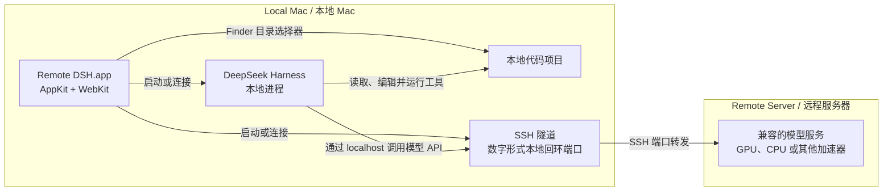

# Remote DSH for macOS

[English](README.md) | 简体中文


### 在原生 Mac App 中，让 DeepSeek Harness 使用运行于远程 GPU 服务器的模型。

**远程服务器负责运行模型，Mac 获得原生工作流。**

Remote DSH 将现有的 DeepSeek Harness 与远程模型配置整合成原生 macOS
工作流。只需打开一个 App，即可启动或连接 SSH 隧道、启动或连接 Harness、选择
本地代码项目，并安全管理由 App 自己启动的进程。

常见部署会使用远程 GPU 服务器，但本封装只要求远程模型服务能够通过用户的 SSH
配置访问，不要求也不会检测某一种特定加速器。

## 功能

| | 能力 |
| --- | --- |
| 原生 macOS 外壳 | 使用 AppKit 窗口和内嵌 WebKit 工作区呈现 Harness。 |
| 自动管理 SSH 生命周期 | 检测配置的本地回环隧道，仅在需要时启动。 |
| 自动管理 Harness 生命周期 | 连接健康的本地 Harness，或启动用户配置的 Harness profile。 |
| Finder 项目选择器 | 打开原生目录选择器，并将选中的本地项目注册到 Harness。 |
| 安全的进程所有权 | 只停止本 App 亲自启动的 SSH 和 Harness 子进程。 |
| 本地优先的封装 | 不增加遥测、凭据存储或额外的项目上传。 |

## 为什么使用 Remote DSH？

在 Mac 上使用远程模型，通常需要同时维护多个环节：

```text
终端      → SSH 隧道
终端      → Harness 启动器
浏览器    → Harness UI
Finder    → 项目路径
终端      → 进程清理
```

Remote DSH 将这套流程缩短为：

```text
Remote DSH.app → 打开项目 → 开始写代码
```

App 负责协调 Mac 上的本地工作流，模型计算仍然留在远程服务器。如果 SSH 隧道或
Harness 已经健康运行，它会直接连接，不会接管所有权。

## 工作原理



DeepSeek Harness 和选中的项目都留在 Mac 本地。远程服务器运行模型服务；已有的
SSH alias 决定如何把本地端口转发到该服务。

## 快速开始

1. 准备一个 SSH alias，用于建立到远程模型服务所需的本地端口转发。
2. 准备一个可执行启动器，用于启动本地 DeepSeek Harness profile。
3. 克隆本仓库、进入仓库目录，然后安装中性的配置示例：

   ```bash
   cd remote-dsh-macos
   mkdir -p "$HOME/Library/Application Support/RemoteDSH"
   cp Resources/config.example.plist \
     "$HOME/Library/Application Support/RemoteDSH/config.plist"
   ```

4. 根据自己的 SSH alias、端口和 Harness 启动器修改配置：

   ```bash
   ${EDITOR:-vi} "$HOME/Library/Application Support/RemoteDSH/config.plist"
   ```

5. 从源码运行 App：

   ```bash
   swift run RemoteDSHApp
   ```

## 系统要求

- 搭载 Apple Silicon 的 macOS 14 或更高版本
- Swift 6 工具链
- 一个能够为远程模型建立本地隧道的现有 SSH alias
- 一个由用户管理、用于启动本地 Harness profile 的可执行文件
- 一个能够通过该隧道访问的兼容模型服务

Remote DSH 不会生成 SSH 配置、安装 DeepSeek Harness 或管理模型服务商凭据。

## 配置

实际运行时配置保存在：

```text
$HOME/Library/Application Support/RemoteDSH/config.plist
```

| 键 | 必需 | 用途 |
| --- | --- | --- |
| `sshAlias` | 是 | 用于建立模型隧道的现有 SSH alias。 |
| `sshLocalPort` | 是 | 由 SSH alias 建立的数字形式本地回环端口。 |
| `harnessPort` | 是 | Harness Web Host 使用的本地端口。 |
| `harnessLauncherPath` | 是 | 用于启动指定 Harness profile 的绝对可执行路径，或以 `~/` 开头的路径。 |
| `displayModelName` | 否 | 仅在 App 界面中显示的非敏感标签。 |

示例文件只使用中性值，不包含凭据字段。两个端口必须都在 `1` 到 `65535` 之间，
并且不能相同。

## 从源码构建和测试

运行行为、打包和隐私检查：

```bash
swift run RemoteDSHTestRunner
/bin/bash Scripts/test-public-tree.sh
/bin/bash Scripts/test-public-history.sh
/bin/bash Scripts/test-atomic-install.sh
/bin/bash Scripts/test-build-app.sh
/bin/bash Scripts/verify-public-tree.sh .
/bin/bash Scripts/verify-public-history.sh .
```

仅在明确指定的绝对路径构建本地 ad-hoc 签名 App，然后验证并打开该副本：

```bash
temporary_root="$(mktemp -d)"
/bin/bash Scripts/build-app.sh \
  "$temporary_root/Remote DSH for macOS.app"
/bin/bash Scripts/verify-bundle.sh \
  "$temporary_root/Remote DSH for macOS.app"
open "$temporary_root/Remote DSH for macOS.app"
```

`build-app.sh` 不会自行选择 Applications 目录。替换用户明确指定的现有目标时，
它会把旧 App 保留在目标父目录下的 `.remote-dsh-backups` 目录中。

## 尽量不打扰你的现有环境

Remote DSH 不会按进程名批量终止进程。它只保存自己启动的 SSH 和 Harness
子进程的精确句柄，并在 App 退出时按照先 Harness、后 SSH 的顺序停止它们。

如果已有健康的 SSH 隧道或 Harness 实例正在运行，Remote DSH 只会连接，并在退出
时保留它们。

## 安全与隐私

- 配置文件保留在本地；本封装的 RPC 和内嵌 Harness 流量仅限于配置的数字形式
  本地回环地址。
- 内嵌导航仅允许配置的 Harness origin；真正的外部 HTTP 和 HTTPS 链接会在默认
  浏览器中打开。
- 本封装不包含模型服务商凭据，不收集分析数据，也不发送遥测。
- Harness 处理的项目内容遵循用户单独管理的 Harness 和模型配置；Remote DSH 不会
  额外上传项目内容。
- 向用户显示前，诊断信息会受到长度限制并进行敏感信息清理。

安全问题报告方式请参阅 [SECURITY.md](SECURITY.md)。

## 当前限制

- 当前公开版本仅提供源码，并且仅支持 Apple Silicon/macOS 14+。
- 不提供经过公证的下载、DMG、自动更新器或 Homebrew cask。
- SSH 配置、远程模型服务、Harness 安装和模型服务商凭据均由用户自行管理。
- Finder 选择器选择的是 Mac 本地项目目录，不是远程文件系统浏览器。
- 本封装不提供也不承诺搜索能力；搜索工具属于用户单独管理的 Harness profile。
- GPU 加速是一种常见部署选择，不是本封装的硬性要求。

## 路线图

- [x] 原生 AppKit/WebKit 外壳
- [x] SSH 与 Harness 自动启动或连接生命周期
- [x] 原生本地项目选择器
- [x] 精确子进程所有权与安全退出
- [x] 第一个仅提供源码的 GitHub Release（`v0.1.0`）

只有在签名、公证和发布流程能够经过验证后，才会评估未来的分发工作。这些内容是
方向，不是交付承诺。

## 参与贡献

欢迎提交 Issue 和范围明确的 Pull Request。提交变更前请运行：

```bash
swift run RemoteDSHTestRunner
/bin/bash Scripts/verify-public-tree.sh .
/bin/bash Scripts/verify-public-history.sh .
```

示例请保持中性；不要提交凭据、真实 hostname、SSH alias、私人项目路径、会话数据
或生成的 App bundle。

## 免责声明与上游项目

Remote DSH for macOS 是一个非官方社区项目。本项目与 DeepSeek 没有隶属关系，
也未获得其背书，不是 DeepSeek 官方产品。

上游运行时为
[DeepSeek Harness](https://github.com/deepseek-ai/deepseek-harness)，由上游根据
[MIT 许可证](https://github.com/deepseek-ai/deepseek-harness/blob/master/LICENSE)
单独分发。本封装不会嵌入该运行时。

## 许可证

Remote DSH for macOS 根据 [MIT License](LICENSE) 发布。上游归属信息请参阅
[THIRD_PARTY_NOTICES.md](THIRD_PARTY_NOTICES.md)。
